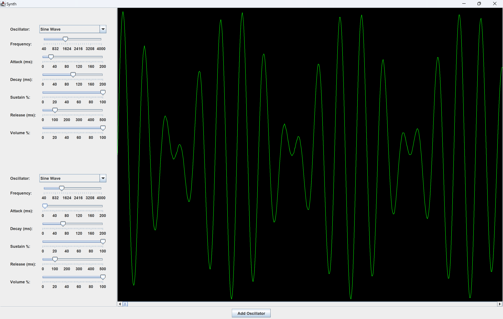

# Java Synth
This is a simple project created to learn low-level sound synthesis using oscillators. The types of oscillators include:
* Sine Waves
* Square Waves
* Saw Waves
* Triangle Waves
* White Noise

The screenshot below shows some of the options for synthesis
